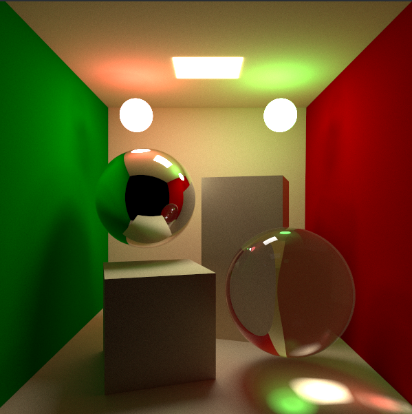

# PTS4D
Continuation of PTS3D, but written in Rust

Goal of this project is to learn Rust + build a medium-performance path tracer with global illumination and some interoperability across C/C++ so it can be integrated with my other project `Wasp8`.

## Example render :)

20k SPP, Ray depth - 10

## Feature Completeness

| Feature      | Status |
| ----------- | ----------- |
|Global Illumination| ✅ |
|Shadows| ✅ |
|Shadow rays| TODO |
|Dielectrics| ✅ |
|Metallics| ✅|
|Diffuse| ✅|
|Emissive| ✅|
|Caustics| ✅|
|Support for arbitrary meshes| ✅ |
|Support for wavefront materials| In progress |
|Arbitrary textures| TODO |
|Multiple samples per pixel| ✅ |
|Real-time movement| ✅ |
|Visualizing the rendering process| ✅ |
|Bounding boxes| ✅ |
|BVH| In progress | 
|CPU parallelization| ✅ |
|GPU support| TODO |
|Depth of Field| TODO |
|Fog| TODO |
|Watertight triangle intersection [(paper)](https://jcgt.org/published/0002/01/05/paper.pdf)| TODO |
|Neural Radiance Caching [(paper)](https://d1qx31qr3h6wln.cloudfront.net/publications/mueller21realtime.pdf) | TODO |
